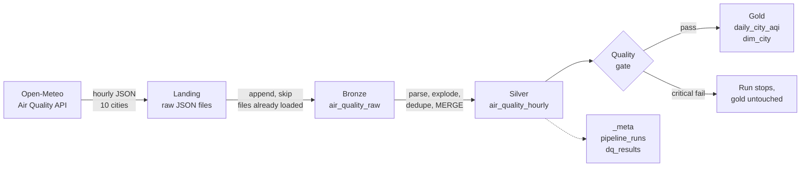

# India Air Quality Lakehouse

[](https://github.com/Guru2497/india-air-lakehouse/actions/workflows/ci.yml)

**[See today's AQI for all 10 cities →](LATEST_AQI.md)** (refreshed every morning by a scheduled run)

A batch lakehouse that collects hourly air pollution data for 10 Indian cities and turns it into
**India's official National Air Quality Index (NAQI)** per city per day, using the breakpoints and
minimum-data rules published by the Central Pollution Control Board (CPCB).

Built with **PySpark** and **Delta Lake** in a Bronze / Silver / Gold (medallion) layout, with
idempotent MERGE upserts, late-arriving data handling, data quality gates, a run audit table and CI.

## Architecture



| Layer | Table | Grain | How it is written |
| --- | --- | --- | --- |
| Landing | `landing/air_quality/ingest_date=…/*.jsonl` | one API response per city per run | atomic file write, never modified |
| Bronze | `bronze/air_quality_raw` | one row per city per landing file | append; payload kept as raw JSON string |
| Silver | `silver/air_quality_hourly` | one row per city per UTC hour | `MERGE` on `(city_id, ts_utc)` |
| Gold | `gold/daily_city_aqi` | one row per city per IST day | `replaceWhere` on the dates a run touched |
| Gold | `gold/dim_city` | one row per city | overwrite from `config/cities.yaml` |
| Meta | `_meta/pipeline_runs`, `_meta/dq_results` | one row per run / per check | append |

## Design decisions

**Raw payload in bronze (schema-on-read).** Bronze stores the API response as a JSON string. If the API
adds or renames a field, ingestion keeps working, and after fixing the parser `airlake rebuild` replays
all bronze history into silver and gold without calling the API again.

**Idempotent by construction.** Bronze skips landing files it has already loaded. Silver uses
`MERGE` keyed on `(city_id, ts_utc)` and only updates a row when a newer ingestion brings different
values. Gold overwrites exactly the IST dates in the batch with `replaceWhere`. Running the same load
twice leaves every table unchanged, which the tests check.

**Late-arriving data.** Upstream values can be revised after first publication. Each incremental run
starts 2 days before the newest stored hour, so revisions are re-read; the `MERGE` turns them into
updates, and gold recomputes only the affected days. Delta's table history keeps the old values.

**UTC storage, IST reporting.** Timestamps are stored in UTC; the IST calendar date is derived explicitly,
because a "day" in Indian AQI reporting runs midnight to midnight IST, not UTC.

**No forecasts in silver.** The API also returns forecast hours. Silver drops any hour later than the
ingestion time, so forecasts are never stored as observations.

**AQI rules in one place.** The CPCB breakpoint table lives once in [`aqi.py`](src/airlake/aqi.py) and
generates both a plain Python function and a Spark column expression. A test checks the two agree.

## How the AQI is calculated

Following [CPCB's National AQI](https://www.cpcb.nic.in/displaypdf.php?id=bmF0aW9uYWwtYWlyLXF1YWxpdHktaW5kZXgvQWJvdXRfQVFJLnBkZg%3D%3D):

* PM2.5, PM10, NO2 and SO2 use the 24-hour average over the IST day.
* O3 and CO use the day's highest 8-hour rolling average (a window needs at least 6 of 8 hours).
* A pollutant gets a sub-index only with at least 16 hours of data that day.
* AQI is the highest sub-index, reported only when at least 3 pollutants have one and at least one is PM2.5 or PM10.
* Categories: Good (0–50), Satisfactory (51–100), Moderate (101–200), Poor (201–300), Very Poor (301–400), Severe (401–500).

**Assumption:** CPCB's Severe band is open-ended (for example "PM2.5 above 250"). Here the Severe
sub-index rises linearly from 401 to 500 at twice the band's lower limit, then caps at 500.

**About the data:** Open-Meteo serves modelled concentrations from the Copernicus Atmosphere
Monitoring Service (CAMS) on a roughly 45 km global grid, not readings from CPCB ground stations. The
AQI here follows CPCB's method but will not match station-level numbers exactly.

## Run it

**Easiest: GitHub Codespaces.** Click **Code → Codespaces → Create codespace on main**. Python 3.11,
Java 17 and all dependencies install automatically. Then:

```bash
make demo        # offline run on fixture data, no network needed
make run         # incremental load from the live API (first run loads 30 days)
make show        # latest AQI per city
```

**On your own machine** you need Python 3.10–3.11 and Java 17. On Windows, use WSL2 (Ubuntu); Spark is
much easier there than on native Windows.

```bash
python -m venv .venv && source .venv/bin/activate
make install
make test
make backfill START=2026-07-01 END=2026-09-30
make show
```

The lakehouse is written to `./lakehouse` by default; set `LAKEHOUSE_ROOT` or pass `--root` to change it.

## Tests

`pytest` runs 40+ tests, all offline:

* **AQI rules**: known sub-index values, category edges, minimum-pollutant and particulate rules.
* **Spark and Python agree** on every sub-index across all pollutants and bands.
* **Silver**: hours exploded and converted, UTC→IST date boundaries, future hours dropped.
* **Idempotency**: loading the same data twice inserts and updates nothing.
* **Late revisions**: revised values update 24 silver rows and change gold for the affected day only.
* **End to end**: gold AQI matches an independent pure-Python calculation from the raw fixture.
* **Quality gate**: duplicate keys stop the run.

CI runs lint, tests and an offline demo on every push. Running the workflow manually with **live**
ticked also does a real load against the API.

## Project layout

```
config/cities.yaml        cities tracked (business key: city_id)
src/airlake/ingest.py     API client with retries; lands raw responses
src/airlake/bronze.py     landing → bronze append
src/airlake/silver.py     parse, explode, dedupe, MERGE
src/airlake/aqi.py        CPCB breakpoints and sub-index logic
src/airlake/gold.py       daily AQI per city, city dimension
src/airlake/quality.py    data quality checks and gate
src/airlake/pipeline.py   orchestration, run audit, CLI
tests/                    unit, Spark and end-to-end tests
scripts/make_fixture.py   generates the deterministic test fixtures
```

## Roadmap

- [x] Bronze / Silver / Gold on Delta Lake with idempotent loads and quality gates
- [ ] dbt models on top of gold: monthly trends, city rankings, worst-day analysis
- [ ] Airflow DAG with daily schedule, retries and backfills
- [ ] Public dashboard: is Bengaluru's air getting better or worse?

## Data and licence

Air quality data: [Open-Meteo Air Quality API](https://open-meteo.com/en/docs/air-quality-api)
(CC BY 4.0), based on Copernicus Atmosphere Monitoring Service data. Code: MIT.
